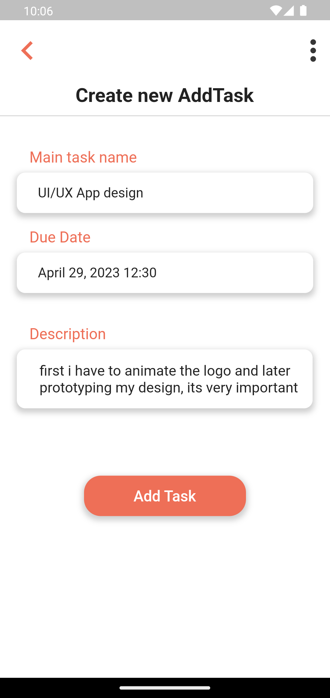
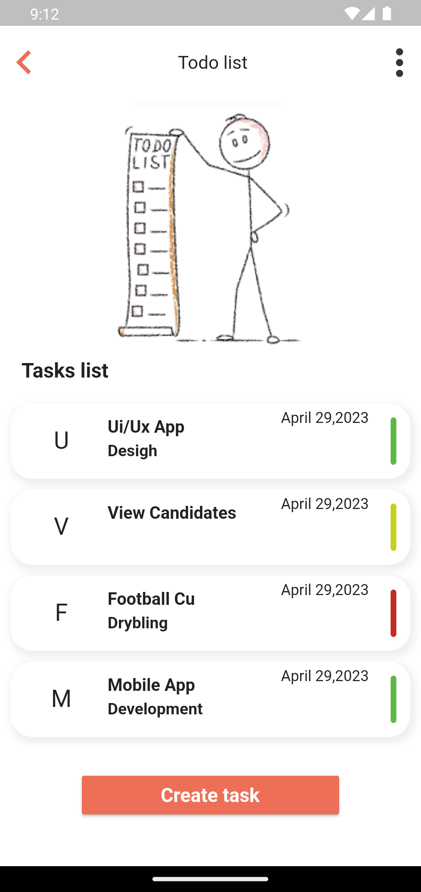
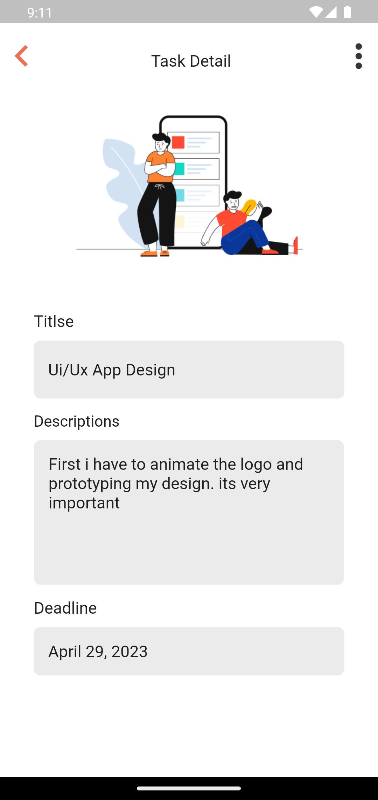

# todo_app

<h1> Overview of the project </h1>

<p>

    A2SV 2023 project phase Mobile Team,This repository serves as a
    central hub for tracking the progress of my app development tasks

</p>

<h4> ScreenshoDemo </h4>

<div style="display:flex;">

  

  

  

  


</div>


## Features:

* Task List
* Adding Task
* Marking Task as Completed 

## Data Layer
- data sources abstraction

``` dart

import 'package:dartz/dartz.dart';
import 'package:todo_app/core/errors/failure.dart';
import 'package:todo_app/features/todo/data/models/task_model.dart';
import 'package:todo_app/features/todo/domain/entities/task_entity.dart';


abstract class LocalDataSourceContract {
  Future<Either<Failure, void>> saveData(TaskModel task);
  Future<Either<Failure, List<TaskEntity>>> getAllTasks();
  Future<Either<Failure, void>> updateIsCompleted(int id, bool isCompleted);
}

```

- data model implementation

```dart
import 'package:todo_app/features/todo/domain/entities/task_entity.dart';

// ignore: must_be_immutable
class TaskModel extends TaskEntity {
 
  TaskModel({
    required int id,
    required String title,
    required String description,
    required DateTime dueDate,
    bool isCompleted = false,
  }) : super(id: id, title: title, description: description, dueDate: dueDate,isCompleted: isCompleted);

  @override
  List<Object> get props => [id, title, description, dueDate, isCompleted];

  factory TaskModel.fromJson(Map<String, dynamic> json) {
    return TaskModel(
      id: (json["id"] as num) as int,
      title: json["title"],
      description: json["description"],
      dueDate: DateTime.parse(json["dueDate"]),
      isCompleted: json["isCompleted"] ?? false
    );
  }


  factory TaskModel.fromEntity(TaskEntity entity) {
    return TaskModel(
      id: entity.id,
      title: entity.title,
      description: entity.description,
      dueDate: entity.dueDate,
      isCompleted : entity.isCompleted
    );
  }
}

```

## Domain Layer

- entity model implementation

```dart
import 'package:equatable/equatable.dart';
import 'package:todo_app/features/todo/data/models/task_model.dart';

// ignore: must_be_immutable
class  TaskEntity extends Equatable {
   int id;
   String title;
   String description;
   DateTime dueDate;
   bool isCompleted;

   TaskEntity({
    required this.id,
    required this.title,
    required this.description,
    required this.dueDate,
    this.isCompleted = false,
  });

   Map<String, dynamic> toJson() {
    return {
      "id": id,
      "title": title,
      "description": description,
      "dueDate":  dueDate.toString(),
      "isCompleted" : isCompleted
    };
  }

  factory TaskEntity.fromModel(TaskModel entity) {
    return TaskEntity(
      id: entity.id,
      title: entity.title,
      description: entity.description,
      dueDate: entity.dueDate,
      isCompleted : entity.isCompleted
    );
  }

  @override
  List<Object> get props => [id, title, description, dueDate, isCompleted];

}

```

- usecase implementation

```dart 
import 'package:dartz/dartz.dart';
import 'package:todo_app/core/errors/failure.dart';
import 'package:todo_app/core/usecases/usecase.dart';
import 'package:todo_app/features/todo/data/repositories/task_repo_impl.dart';
import 'package:todo_app/features/todo/domain/entities/task_entity.dart';
// import 'package:todo_app/features/todo/domain/repositories/task_repo_contract.dart';

class AddTaskUsecase implements Usecase<void, TaskEntity> {
  final TaskRepoImpl repository = TaskRepoImpl();

  AddTaskUsecase();

  @override
  Future<Either<Failure, void>> call(TaskEntity params) async {
    return await repository.addTask(params);
  }
}

```

- repository contract implementation


```dart
import 'package:dartz/dartz.dart';
import 'package:todo_app/core/errors/failure.dart';

import '../entities/task_entity.dart';

abstract class TaskRepoContract {
  Future<Either<Failure,List<TaskEntity>>> getAllTasks();
  Future<Either<Failure,TaskEntity>> getTaskById(int taskId);
  Future<Either<Failure,void>> addTask(TaskEntity task);
  Future<Either<Failure,void>> updateTask(TaskEntity task);
  Future<Either<Failure,void>> updateTaskCompletionStatus(int taskId, bool isCompleted);
}

```

## Network

- Network implementation

```dart
import 'package:internet_connection_checker/internet_connection_checker.dart';

abstract class NetworkInfo {
  Future<bool> get isConnected;
}

class NetworkInfoImpl implements NetworkInfo {
  final InternetConnectionChecker internetConnectionChecker;
  NetworkInfoImpl(this.internetConnectionChecker);
  @override
  Future<bool> get isConnected => internetConnectionChecker.hasConnection;
}


```